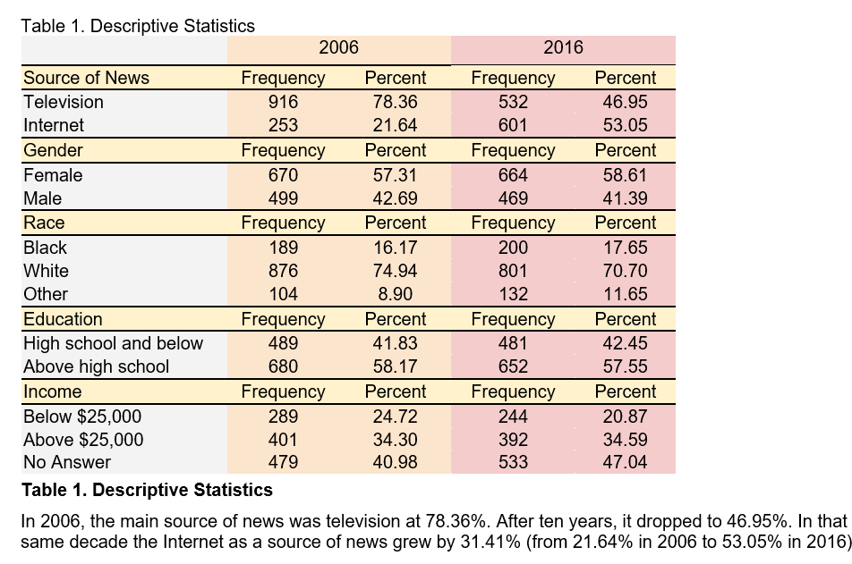
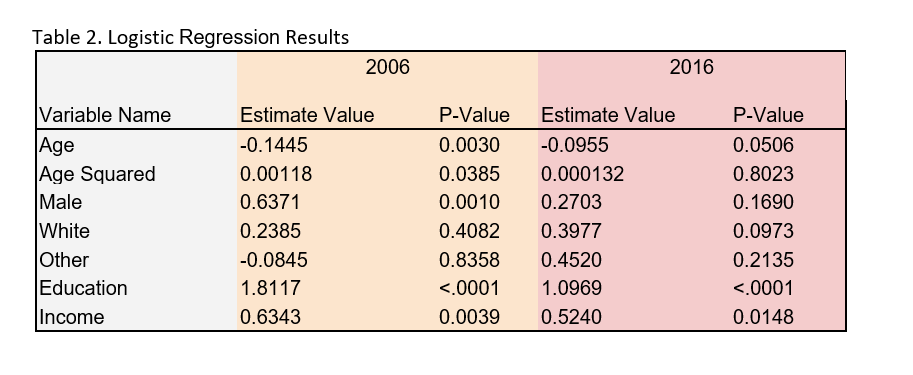
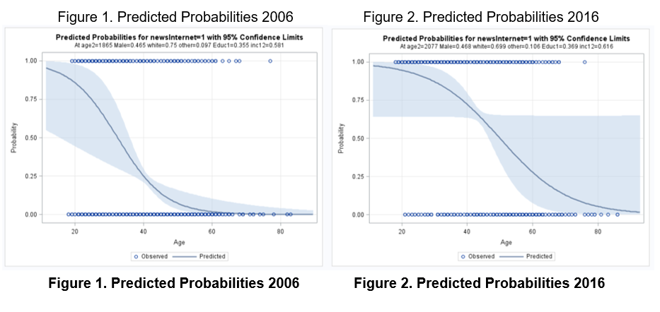

# ABSTRACT

Twenty years ago, only 12% of Americans consumed their news through the Internet. Since then, innovations in the use of information and communication technologies have made news accessible in different formats to millions of people all over the world. Businesses involved in content creation and diffusion, such as media organizations and marketing firms, need to be aware of the constant change of consumer preferences to remain competitive. To this end, our goal was to examine demographic variables such as age, race, income, gender, and education, and their effect on the way Americans consume their news, more specifically through the Internet or television. We performed a logistic regression analysis on a dataset from the general social survey. Our analysis indicates that, over the last decade, age has become less impactful in predicting the source of news of Americans. Additionally, we found that those consuming their news through television tend to be older, non-white, low-income, low-educated people, whereas those consuming their news through the internet tend to be younger, white, higher educated, and higher income-earning people. We argue that organizations will find these findings useful in their effort to create relevant content and ads that appeal to specific target demographics.

# INTRODUCTION

Twenty years ago, only 12% of Americans consumed their news through the Internet (Kohut, 1996). Since then, innovations in the use of the Internet, as well as in mobile technology have made news accessible from almost anywhere. Today, 43% of Americans say they get their news online and 50% say they get their news through television (Gottfried, 2017). This shift in the primary source of news may affect how media companies and other businesses interact with their target audience and market segments. In this context, how can media companies attract different audiences on different platforms? Furthermore, how can businesses adjust their advertising budget in response to a shift in primary source of news? Our analysis explores how Americans consume their news, more specifically through the Internet or Television, and if certain demographic variables such as age, race, income, gender, and education can accurately predict this preference.

# DATA

The General Social Survey (GSS) is conducted every year since 1972 by the National Opinion Research Center at the University of Chicago. GSS uses a core set of questions on demographics, attitudes, and behaviors, as well as some topics of special interest, to monitor and explain trends in American society. The GSS dataset contains 5,881 attributes and 62,466 records.

Although GSS contains questions on a wide range of topics, our analysis is only concerned with data from the 2006 and 2016 surveys on the primary source of news, age, gender, race, income, and education. Of the original 62,466 records, 2,302 were used for our analysis. The following table describes the frequencies of each variable and is summarized below:

# PROBLEM

The consumption of news in America is an important part of daily life. In 2016, more than seven-in-ten U.S. adults said they followed national and local news somewhat or very closely (Mitchell, 2016). However, traditional media, such as television, have been in a down trend since the rise of the Internet. In 2000, only 52% of U.S. adults used the Internet, whereas in 2006, 71% used Internet; by 2016, that number jumped up to 88% (Pew Research, 2016).

As information and communication technologies continue to proliferate through American society, businesses need to differentiate their content and marketing strategies for both traditional and online media. When businesses buy ad-space with media organizations, it is important to know the ad will reach the intended target demographic(s). Moreover, it is important to know that those demographics may be different in online platforms and in television. Media organizations may also need to create different content based on the platform they use.

# DATA CLEANING / VALIDATION

The complete GSS dataset was downloaded from the GSS Data Explorer website in SPSS format. We used PROC IMPORT to convert the GSS dataset into a SAS dataset and import it into the Work directory. Then, we used PROC SQL to create two tables from the original dataset. The first table was a dataset that included id, year, source of news, sex, age, race, income, and education. This dataset was also filtered by year (2006) and source of news (values 3 or 5 to denote Internet and television, respectively). The second table was the same as the first, except the year was 2016.

To clean the data on both tables we decided on a binary format. We used “when” statements to recode the data from its original code to binary. The id and year attributes remained unchanged in both tables, but the remaining attributes were changed as follows:

- Source of News: If source of news = 3 (Internet), then convert value to 1; else (TV) convert value to 0.
- Sex: If sex = 1 (male), then convert value to 1; else (female) convert value to 0.
- Age: Values 89, 98, and 99 were converted to dots (.) to be ignored by SAS when performing analysis. Otherwise, the values remained the same.
- Race: There were three possible answers for the race question, white, black, or other. We split the race attribute into two separate attributes, “white” and “other” to compare against the variable “black”. For the “white” attribute, if race = 1 then convert value to 1; else, convert value to 0. For the “other” attribute, if race = 3 then convert value to 1; else, convert value to 0.
- Education: Values 98 and 99 were converted to dots (.). Education is split between those who pursued education past high school and those who did not. If education is greater than 12, then convert value to 1, else convert value to 0.
- Income: Values 13, 98, 99, 0, and dots (.) were converted to, or kept as, dots. Income is divided between income below and greater than or equal to $25,000 USD. If income is equal to 12 (income $25,000+) then convert value to 1, else (income less than \$25,000) convert value to 0.
- Age Squared: This was added as a new attribute. We simply took each age value and squared the number. Values 89, 98, and 99 were converted to dots (.).

The changes above were achieved with PROC SQL. We altered each table to add new columns for each attribute that required changes. Then, we updated each new column with the corresponding criteria. At this point, we kept both the new and original attributes to validate that our program was correctly populating the new columns with values that matched the data in the original attributes. When we were confident that the new attributes satisfied our requirements, we dropped all the original attributes.

# ANALYSIS

For our analysis of the data, we used PROC LOGISTIC to perform logistic regression because the dependent variable of source of news is a binary outcome where 1 is equal to the Internet and 0 is equal to television. The following table summarizes our results and is explained below:

- Age in 2006 and 2016 is significant and negative, meaning that as age increases, the probability of source of news being television increases. However, in 2016 Age is still significant, but has less of an impact, meaning that less older people are using television as their main source of news.
- Age Squared is significant in 2006, but not in 2016, suggesting that elderly people were more likely to use television as their source of news in 2006, but as time progresses, age can no longer determine source of news.
- Male in 2006 is significant, but is not significant in 2016. In 2006, men are more likely to use the Internet for their source of news.
- White is not significant in 2006, but is significant in 2016 and shows that Caucasian Americans are more likely to use the Internet than African-Americans or people of other races.
- Education is significant in 2006 and 2016 and positive, meaning that those who received education for any number of years past high school are more likely to use Internet than television as a source of news. The magnitude has decreased over time, meaning that lower educated people are using the Internet more as a source of news.
- Income is also significant in both years and suggests that those earning more than \$25,000 use the Internet over television. However, the impact decreases from 2006 to 2016, denoting that since 2006, more low-income earning Americans are more likely to use the Internet as their source of news than in previous years.

Our analysis found that Americans consuming their news through television are mostly older, non-white, low-income, low-educated people, while those consuming their news through the Internet are mostly younger, white, higher educated, and higher income-earning people. This is important for media organizations and other businesses that need to tailor their content or advertising to meet the needs of these demographics. Media organizations need to retain their viewers by appealing to the demographics that they provide for. Businesses need to be efficient with advertisement spending by designing the content of the ads hosted on a news medium to interest the demographics who use that medium, whether television or the Internet.

# VISUALIZATION

The graphs above depict the trend in American’s source of news in 2006 (Figure 1) and 2016 (Figure 2). In 2006, nearly 100% of Americans older than 60 years used television as their source of news. Since 2006, innovations in information and communication technology have given Americans greater access to the Internet. In 2016, 74% of Americans aged 50-64 and 42% aged 65-and-older owned a smartphone (Smith 2017). The graphs reflect this trend. In 2016, the effect of age on source of news was less impactful as Americans got older.

# GENERALIZATION

The GSS is part of a national data collection program and collects data on demographic variables such as age, race, gender, income, and education. The GSS targets adults (18-and-older) and randomly selects respondents living in households across the U.S. The original dataset includes data on over 62,000 respondents, and our analysis used data on over 2,000 respondents. The GSS has collected data on societal change and studied the growing complexity of American society for more than 40 years. The GSS has been used more than 27,000 times in newspaper articles, journals and Ph.D. dissertations, and used in classes by 400,000 students every year. Thus, our dataset is nationally representative, and our results are generalizable to the U.S. population.

# SUGGESTIONS FOR FUTURE STUDIES

The U.S. is one of the most racially and ethnically diverse places in the world. “Today, a near-record 14% of the country’s population is foreign born compared with just 5% in 1965” (Cohn, 2016). But America is also a country with a growing political divide. “An overwhelming majority (86%) of Americans say conflicts between Democrats and Republicans are either strong or very strong” (Gramlich, 2017). In future research, variables such as political affiliation, attitudes towards political parties, location, and all different races should be considered. This would allow analysis of smaller communities and different cultural settings. Additionally, future researchers should consider a comparative analysis against other countries.

# CONCLUSION

Based on the results of our analysis, we can address the implications for media companies and businesses. Because the demographics of those who seek their news from television are mostly older, non-white, low-income, low-educated people while those finding their news on the Internet are mostly younger, white, higher educated, and higher income-earning people, media companies need to differentiate the content of their television channels from their websites to ensure that they do not lose their target audience by appealing to mismatched demographics. Businesses need to be aware of the demographics that use each news medium so that they make an informed decision regarding the appropriate advertising medium or the advertising content. Ultimately, media organizations and businesses need to be aware of the constant change of consumer preferences to remain competitive.

# REFERENCES

Cohn, D., Caumont, A. (2016, March 31). 10 demographic trends that are shaping the U.S. and the world. Retrieved from http://www.pewresearch.org/fact-tank/2016/03/31/10-demographic-trends-that-are-shaping-the-u-s-and-the-world/

Gottfried, J., & Shearer, E. (2017). Americans’ online news use is closing in on TV news use. Retrieved from http://www.pewresearch.org/fact-tank/2017/09/07/americans-online-news-use-vs-tv-news-use/

Gramlich, J. (2017, December 19). Far more Americans say there are strong conflicts between partisans than between other groups in society. Retrieved from http://www.pewresearch.org/fact-tank/2017/12/19/far-more-americans-say-there-are-strong-conflicts-between-partisans-than-between-other-groups-in-society/

Kohut, A. (1996, December 16). News Attracts Most Internet Users. Retrieved from
http://www.people-press.org/1996/12/16/online-news-consumption/

Mitchell, A., Gottfried, J., Brathel M., Shearer E. (2016, July 7). The Modern News Consumer. Retrieved from http://www.journalism.org/2016/07/07/the-modern-news-consumer/

Pew Research, (2017, January 12). Internet/Broadband Fact Sheet. Retrieved from
http://www.pewinternet.org/fact-sheet/internet-broadband/

Smith, A. (2017, January 12). Record shares of Americans now own smartphones, have home broadband. Retrieved from www.pewresearch.org/fact-tank/2017/01/12/evolution-of-technology/

# CONTACT INFORMATION

Your comments and questions are valued and encouraged. Contact the authors at:

### Ethan Stager

Ethan.Stager@student.csulb.edu

### Jorge Nuño

Jorge.Nuno@student.csulb.edu

### Andrew A. Martinez

Andrew.Martinez04@ student.csulb.edu
