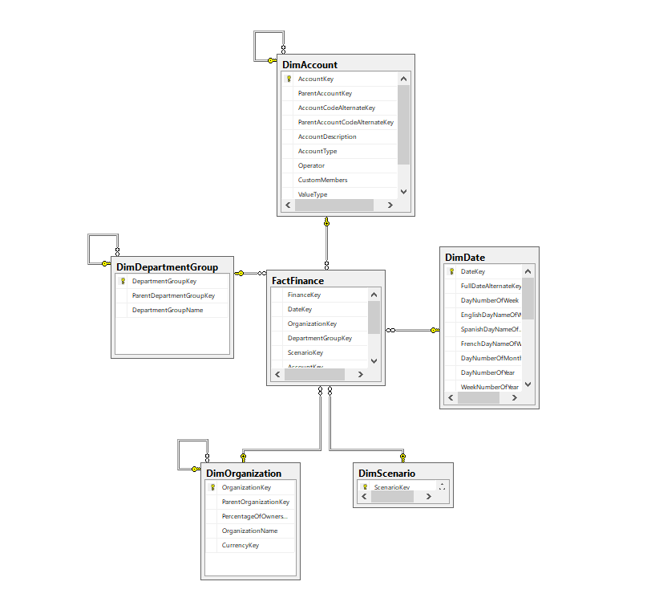
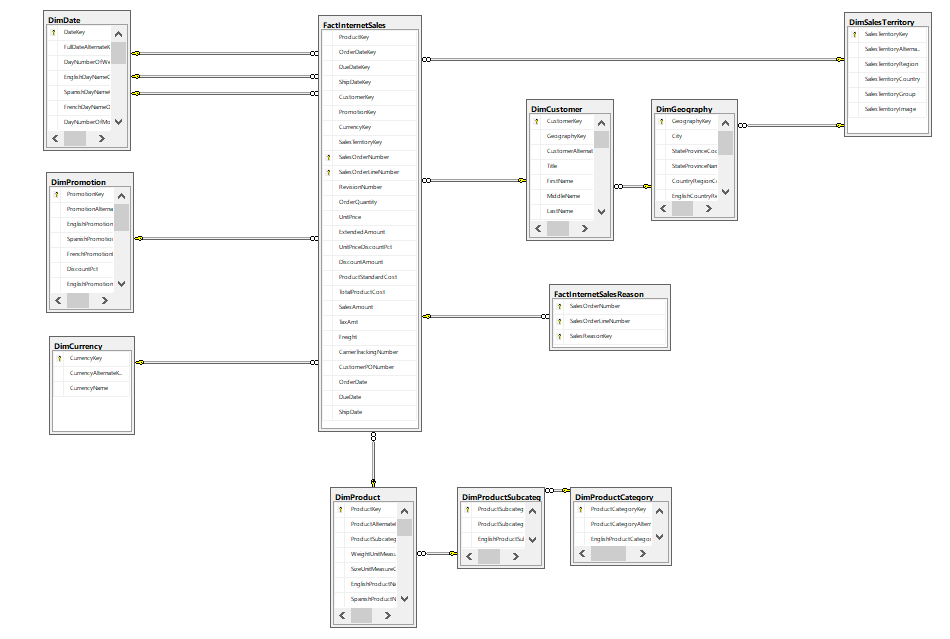

# Data Warehouse

- Integrates data from multiple sources
- Existing data does not change
- New data loaded periodically
- Contains data needed to answer business questions

# ETL: Extract, Transform, Load

The process to add additional data to the data warehouse is the ETL process.

- Pull data out of various locations (Extract)
- Change the data in some way (Transform)
- Insert the data into data warehouse (Load)

ETL is an important part of a data warehouse. When you first set up a data warehouse, a lot of your work goes into designing and building the table structure that will hold the data. Once that's done, it typically doesn't change very often and therefore there's not a lot of maintenance to be done there. On the other hand, the ETL process often does have some changes and some maintenance that needs to be done.

ETL is often importing data from an external entity, in other words data we have little or no control over. When something peculiar happens to that data, our ETL process has to react to that. So the ETL process is often changed after the initial deployment.

# Differences Between Typical Database and Data Warehouse

## Typical Database

A typical database implements OLTP (Online Transaction Processing)

- Transaction implies that the data will be changing and these databases are designed and optimized to handle the changes.

## Data Warehouse

A data warehouse implements OLAP (Online Analytical Processing)

- Instead of optimizing changes, a data warehouse optimizes analysis.

# Types of tables

A data warehouse contains two main types of tables:

## Fact Tables

A fact table contains measurements of business processes.

- ex. money

## Dimension Tables

Dimension tables are used for filtering, grouping, and sorting the data.

- ex. time, location

# Designing Dimension Tables

There are two techniques for designing dimension tables:

## Star Schema

The star design has multiple dimension tables referencing a fact table.

- dimension tables are not related to other dimension table.
- All the information about each dimension is contained in a single table
- It is the simpler technique
- Easier to write queries
- Typically gives the best performance, but also gives less options

## Snowflake Schema

In a snowflake design, dimension tables can have relationships to one another

- Relationships among dimension tables allows a dimesion table to be broken down into more detail and give more option on filtering, sorting, and grouping.
- Queries are more complex
- Performance may take a hit

## In the Real World...

Realistically, it is rare to find a data warehouse that has a 100% star or snowflake design. It is more common to see a mixture of both techniques.
