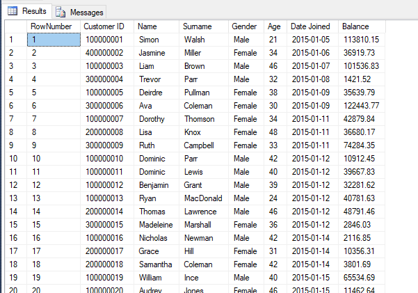

# ETL Using SSIS

This was a small and simple project with the goal of illustrating the ETL process using SSIS and SQL Server Express

1. Installed SQL Server 2014 Express and created a database called DSTRAINING

2. Installed the SSDT-BI package

3. Created the folder structure for the project

4. Downloaded the data set into the Original_Data folder

5. Copied the data set into the Prepared Data folder. Used Excel to clean the data set by changing the formatting of the Date-Joined and Balance columns.

6. Copied the clean data set into a new folder in the Uploaded_Data folder.

# SSIS

1. Used MSVS Shell to create a new SSIS project

2. Created a new Data Flow Task

3. Added a Flat File Source (file in the Uploaded_Data folder)

4. Added a OLE DB Destination (DSTRAINING database)

5. Loaded the data into the DSTRAINING database

