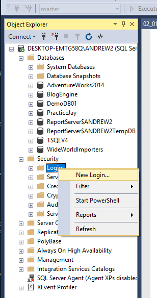

# CREATE AND MAINTAIN USERS

In order to create new user accounts for the database, we first need to create a new login account for the server



Then, we create the database user

```sql
USE WideWorldImporters;
GO

-- create user at the SQL Server login level, then add to the database
CREATE USER UserName FOR LOGIN LoginName;
GO
```

Logins are created at the server level, while users are created at the database level. In other words, a login allows you to connect to the SQL Server instance, and permissions inside the database are granted to the database users, not the logins. The logins will be assigned to server roles (for example, serveradmin) and the database users will be assigned to roles within that database (eg. db_datareader, db_bckupoperator).

Logins must be mapped to a database user to connect to a database. If your login is not mapped to any database user, you can still connect to SQL Server instance using SQL Server Management Studio (SSMS), but you’re not allowed to access any objects in the database. To access any objects in the database, you must have a login that’s mapped to a user in the database, and that user must be granted appropriate rights in the database.

The database user does not have credentials of its own and relies on the server login for authentication. This means that there is no password associated with a database user. Below we’ll walk you through the steps of creating a new login and user, mapping a user to a login.

## We can create new database users without a server login

```sql
USE WideWorldImporters;
GO
-- create additional loginless users
CREATE USER WarehouseSupervisor WITHOUT LOGIN;
CREATE USER WarehouseManager WITHOUT LOGIN;
CREATE USER SalesAssociate WITHOUT LOGIN;
CREATE USER SalesManager WITHOUT LOGIN;
CREATE USER PurchasingAnalyst WITHOUT LOGIN;
GO
```

# MANAGE DATABASE OBJECT PERMISSIONS

Once users have access to a SQL Server instance and the databases with it, their ability to perform required tasks should be assigned carefully. While individual permissions can be assigned to each individual table, it's often a much better approach to use database roles instead. By default, users begin with only the permissions granted to the public role, which isn't very many at all. To do anything useful on the database, they'll need to be given the ability to perform tasks. To manage permission SQL Server uses three permissions statements that pair a user with an ability:

GRANT: gives permission to perform a task

REVOKE: removes permission to perform a task

DENY: overrides any grant permission

If a user is issued both a revoke and a grant, through different group memberships, then the grant permission will override the revoke. And the user will still be able to perform the task.

A full listing of all available permission: https://msdn.microsoft.com/library/ms191291.aspx

```sql
-- assign WarehouseManager some permissions
ALTER ROLE db_datareader ADD MEMBER WarehouseManager;
GO

-- grant insert permission on New Products table to WarehouseManager
GRANT INSERT ON Warehouse.NewProducts TO WarehouseManager;
GO

-- test permissions
EXECUTE AS USER = 'WarehouseManager';
GO

INSERT Warehouse.NewProducts
    VALUES  ('Salted Cashews');
GO

SELECT * FROM Warehouse.NewProducts;
GO

-- error: insert permission denied
INSERT Application.Cities (CityName)
    VALUES  ('Bellingham');
GO

-- return to dbo
REVERT;

-- what if you don't want a user to read from a specific table?
SELECT * FROM Application.SystemParameters;
GO

-- revoke permission granted through group membership
-- this would not work because the grant takes precedence over the revoke
REVOKE SELECT ON Application.SystemParameters TO WarehouseManager;
GO

-- instead, we need to use deny
-- deny permission granted through group membership
-- A DENY will override any of the other permissions that have been granted.
DENY SELECT ON Application.SystemParameters TO WarehouseManager;
GO

```

# CREATE AND MAINTAIN CUSTOM ROLES

SQL Server includes many built-in Server and Database level Roles that users can be assigned to but sometimes they're not specific enough for your particular needs. Instead of assigning permissions to users, directly, consider building Custom Roles instead, that way groups of users with similar requirements can be assigned to a single Role which makes management of their permissions much easier.

```sql
-- create a user-defined role
CREATE ROLE ProductEntry;
GO

-- grant permissions
GRANT SELECT ON Warehouse.NewProducts TO ProductEntry;
GRANT SELECT ON Warehouse.NewVendor TO ProductEntry;
GRANT INSERT ON Warehouse.NewProducts TO ProductEntry;
GO

-- assign a user role-membership
ALTER ROLE ProductEntry ADD MEMBER WarehouseManager;
GO
```

# CONFIGURE ROW LEVEL SECURITY

When enabled, row level security will actively control access to specific rows of data in a data table based on the characteristics of the user that's making the request. For instance, a regional sales manager will only see the records of transactions that occurred within their region, not the entire company. Access to row level data in a table is restricted by a security predicate defined as an inline table-valued function.

```sql
-- create a new schema to hold our predicate function
CREATE SCHEMA Security;
GO


-- create predicate function to restrict rows
CREATE FUNCTION Security.EmployeeRLS(@IsEmployee int)
RETURNS TABLE
-- schemabinding locks the function to any tables that it relies on
WITH SCHEMABINDING
AS
-- returns a table with a single value of 1 if the isEmployee value is = to 1 or the username is dbo
RETURN (SELECT 1 AS AccessResult
        WHERE @IsEmployee = 1 OR USER_NAME() = 'dbo');
GO


-- create security policy to apply the function
CREATE SECURITY POLICY FilterPeopleByEmployeeStatus
-- will filter the data anytime a user attempts to read data with a select, update or delete statement
ADD FILTER PREDICATE Security.EmployeeRLS(IsEmployee)
ON Application.People,
-- this triggers when a user attempts a write operation such as after insert, after update, before update, before delete
ADD BLOCK PREDICATE Security.EmployeeRLS(IsEmployee)
ON Application.People AFTER UPDATE;
GO

```

# CONFIGURE DYNAMIC DATA MASKING

When enabled, Dynamic Data Masking allows users to query information out of the data tables, but it will apply various obfuscation techniques to make the data less readable. This is different from a full encryption in that the values are masked on the SQL server side before being sent to the user. You've probably seen this technique applied when you type your password into a web form where the individual characters that you type get replaced by an asterisk or a bullet character on the screen.

```sql
-- apply data masking
ALTER TABLE NewPeople ALTER COLUMN FullName
	-- with the partial function you specify how many character you want to see at the beginning and end
    ADD MASKED WITH (FUNCTION = 'partial(1, "***",3)');
ALTER TABLE NewPeople ALTER COLUMN PhoneNumber
	-- default replaces character strings with x and numerical values with 0
    ADD MASKED WITH (FUNCTION = 'default()');
ALTER TABLE NewPeople ALTER COLUMN EmailAddress
	-- shows the first character, then X's, and then the domain that is used
    ADD MASKED WITH (FUNCTION = 'email()');
ALTER TABLE NewPeople ALTER COLUMN IsEmployee
    ADD MASKED WITH (FUNCTION = 'default()');
GO


-- LIMITATION 1: there is no way to grant or deny unmask to specific tables. It's an all or nothing deal
-- give sales manager unmask permission
GRANT UNMASK TO SalesManager;
GO
-- deny unmask to sales manager
DENY UNMASK TO SalesManager;
GO

-- LIMITATION 2: You can't apply Dynamic Data Masking on columns where one or more objects access the column, computed columns, columns that you use always encrypted, columns that are a part of a file stream set, or columns used in a full text index.

-- LIMITATION 3: Finally, masked values can sometimes be figured out by the application of a creative query or a simple brut force. So it shouldn't be considered as an alternative for a full encryption strategy.
```
