# Large Database Backup Strategies

## 1. USE DIFFERENTIAL AND LOG BACKUPS

Full backups are easy to make and restore from, but they take the longest to complete. As the database grows, you'll want to transition to more of these partial database backups (differential and log backups) that focus on just the items that have changed since the last full backup was made.

## 2. LIMIT CHANGES TO THE DATABASE

Once you start using differential and log backups, you can further save time by limiting the number of changes that occur on the database. Regular business activities will, of course, still occur, but general maintenance tasks might be postponed or scheduled to a more appropriate time. For instance, consider timing the rebuilding of indexes to only occur right before a regular full backup so that all of those changes don't need to be rolled up into the differential backups.

## 3. SEPARATE DATA INTO FILEGROUPS

To speed up a backup, you should also consider what you're backing up. If you have a lot of cold data that doesn't change much, typically this comes in the form of historical records, you might be able to split that off and store it in separate file groups. Each file group can have a backup schedule that relates to the frequency at which the changes occur and more frequent backups can be focused on the hot or live data and infrequent backups can be made of the cold data since it isn't likely to change much from day to day.

## 4. ENABLE BACKUP COMPRESSION

With backup compression enabled, you'll reduce the amount of data that needs to be backed up. This does place additional load on the CPU, but it can dramatically reduce the amount of data that needs to be written to a drive. Even better, if you're backing up to a network location, the time saved transferring packets can be quite significant and well worth the extra impact on the CPU.

## 5. OPTIMIZE DRIVE PERFORMANCE

Consider where your backups are being saved to. Many servers are configured to write data as fast as possible. However, making backups requires that the drives quickly read the data back out again as well. Ensuring that the types of drives that are being used match your needs can have a big impact on how long backups take.

Also, the backup files should never get saved to the same physical drive as your database files so that the server can read and write data simultaneously to two different devices. And if I/O speed is of utmost importance, consider implementing a RAID array which uses redundant disk drives to duplicate and mirror data, which can also dramatically increase the speed at which it can read and write.

## 6. IMPLEMENT HIGH AVAILABILITY

Taking advantage of some of the high availability features of SQL Server will automatically create redundant copies of your data and log files. These can sometimes be used for creating backups without impacting your main server's operation.

# Configure Database Recovery Models

A database transaction log records all of the changes that are made to a database. SQL Server supports three different Recovery Models that control how the transaction log of a database is maintained. Deciding which one of these to use, depends on the requirements that you have for protecting your data during a restore.

## Simple Recovery Model

- Automatically purges the transaction log
- Cannot restore log backups
- Does not support Always On or Database mirroring
- Cannot restore database to a point-in-time

## Full Recovery Model

- Completely logs every transaction
- Supports point-in-time restores
- Requires transaction log backups
- To do this, the transaction logs will need to be backed up, in addition to the full database back up

## Bulk-Logged Model

- Maintains a transaction log (similar to full recovery model)
- Does not fully log bulk load operations. This makes the bulk data imports perform quicker and keeps the file size of the transaction log down, but...
- Does not support the point-in-time recovery of the data

## Implementing the Recovery Models

- right-click on the database and select properties
- select Options
- select the recovery model from the dropdown

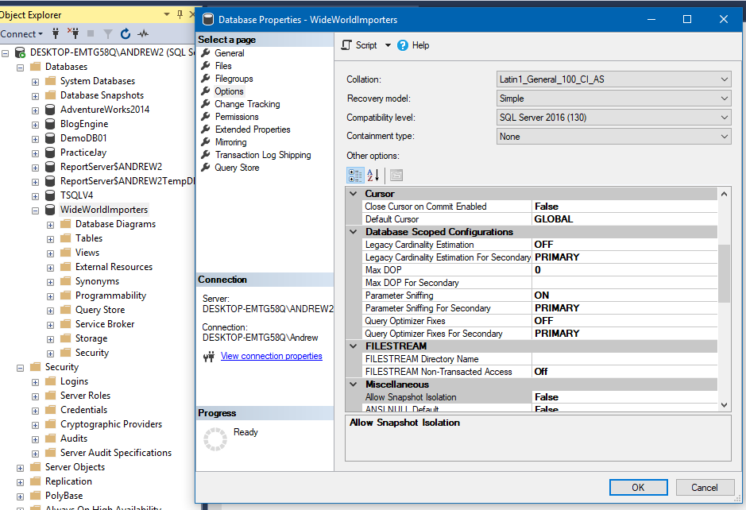

We can also do this in TSQL

```sql
-- review the recovery model with T-SQL
SELECT name, recovery_model_desc
   FROM sys.databases
   WHERE name = 'DatabaseName';
GO

-- change the recovery model
ALTER DATABASE DatabaseName SET RECOVERY SIMPLE;
GO
```

# Manage Transaction Log Backups

With our recovery model set to full, the transaction log will be maintained by SQL server and can be used to perform point-in-time restores. In order to do this though, we need to have a recent backup of the transaction log in addition to the data file.

```sql
-- create full backup (our data file)
BACKUP DATABASE TransactionLogDB
    TO DISK = 'C:\TempSQL\TransactionLogDB.bak'
    -- with format line will simply overwrite any existing backups if there are any there already and it will create a new media set.
    WITH FORMAT;
GO

-- create transaction log backup
BACKUP LOG TransactionLogDB
   TO DISK = 'C:\TempSQL\TransactionLogDB.log';
GO
```

Now we can restore to a point-in-time using our backup data file and the backup transaction log

- right-click on the databases folder
- select Restore Database
- select Device and add the backup media
- select OK, OK

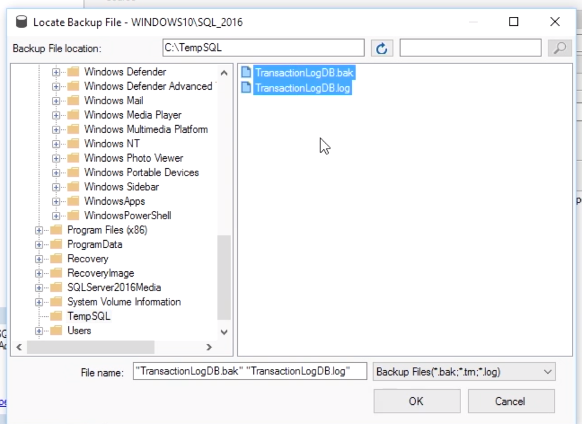

- select Timeline to specify a point-in-time to restore to

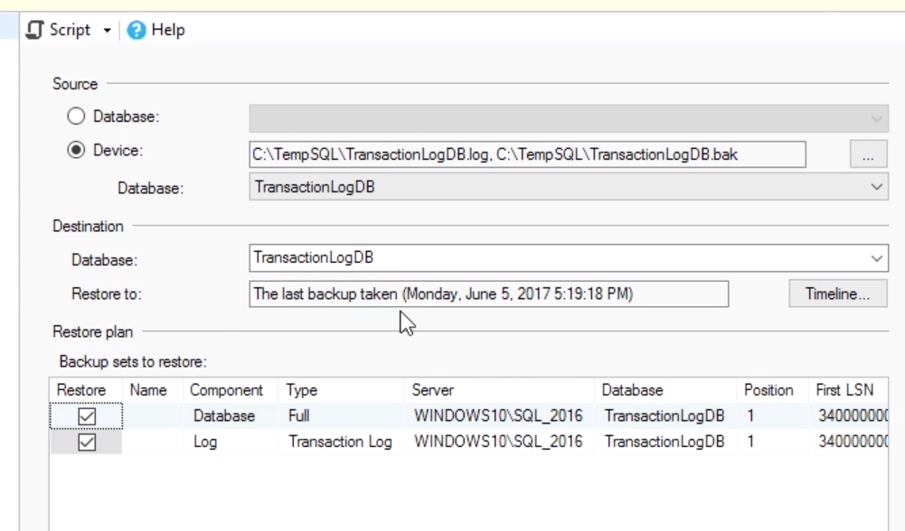

# Configure Backup Automation

Backups and other routine maintenance tasks can be setup to run automatically. This not only takes the burden off of the administrators to remember to create the backup, it allows the backups to be run during a specific time, usually at night when the load of a server would be low.

To automate a backup we can create a maintenance plan. The maintenance Plan Wizard performs routine administration tasks such as:

- check database integrity
- perform index maintenance
- update database statistics
- perform database backups

To setup a maintenace plan:

Under the management folder, select maintenance plan.

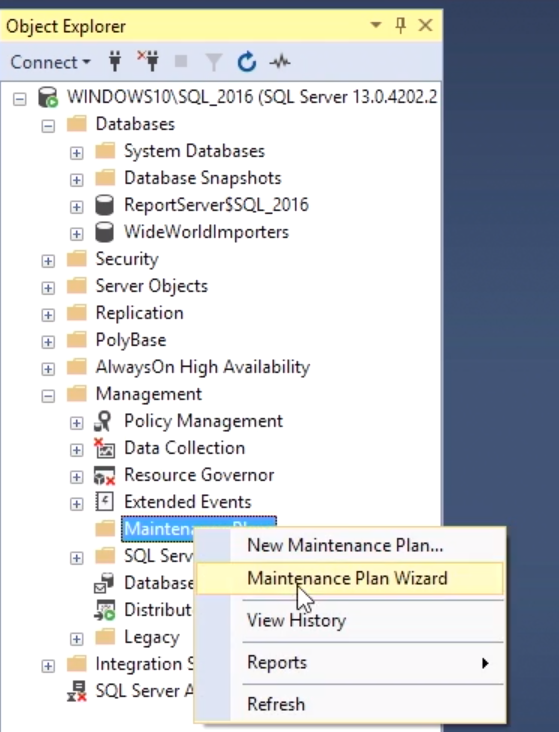

You might receive an error if the SQL Server Agent is not running.

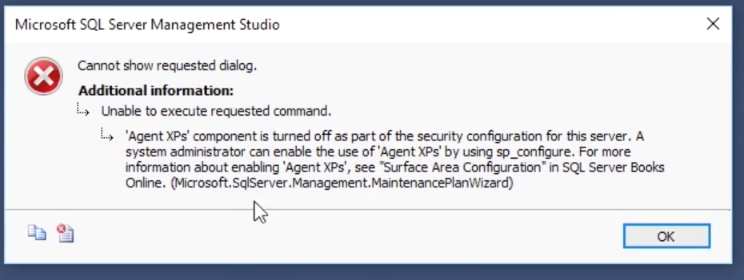

To turn on the SQL Server Agent, right-click and select start

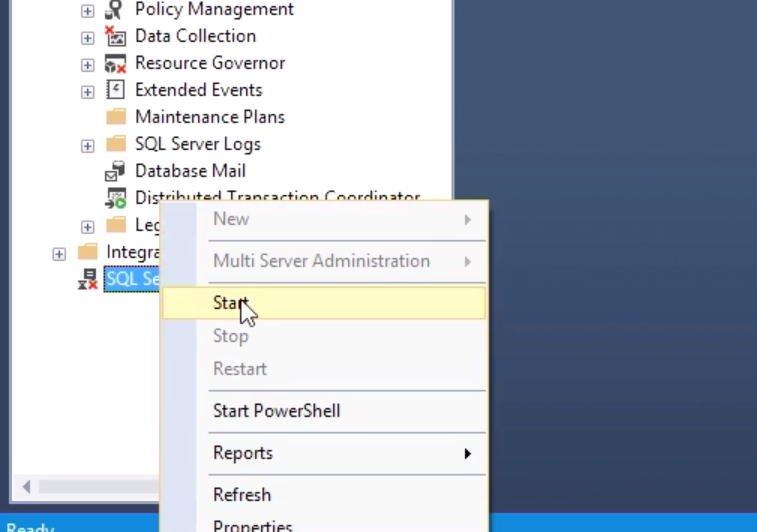

Now, we can run the Maintenance plan wizard. Add a name and description.

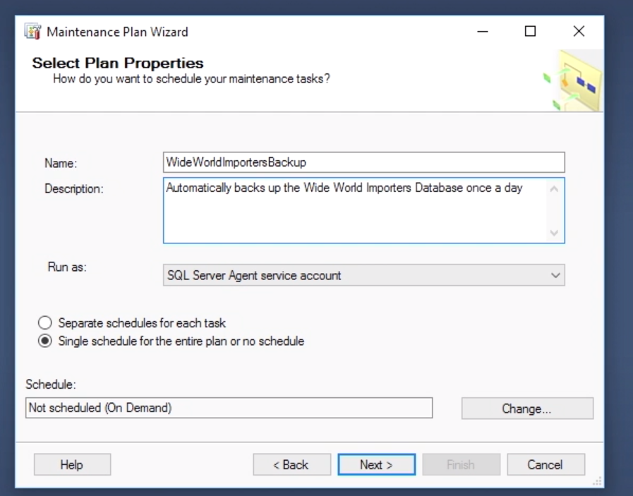

Change the schedule

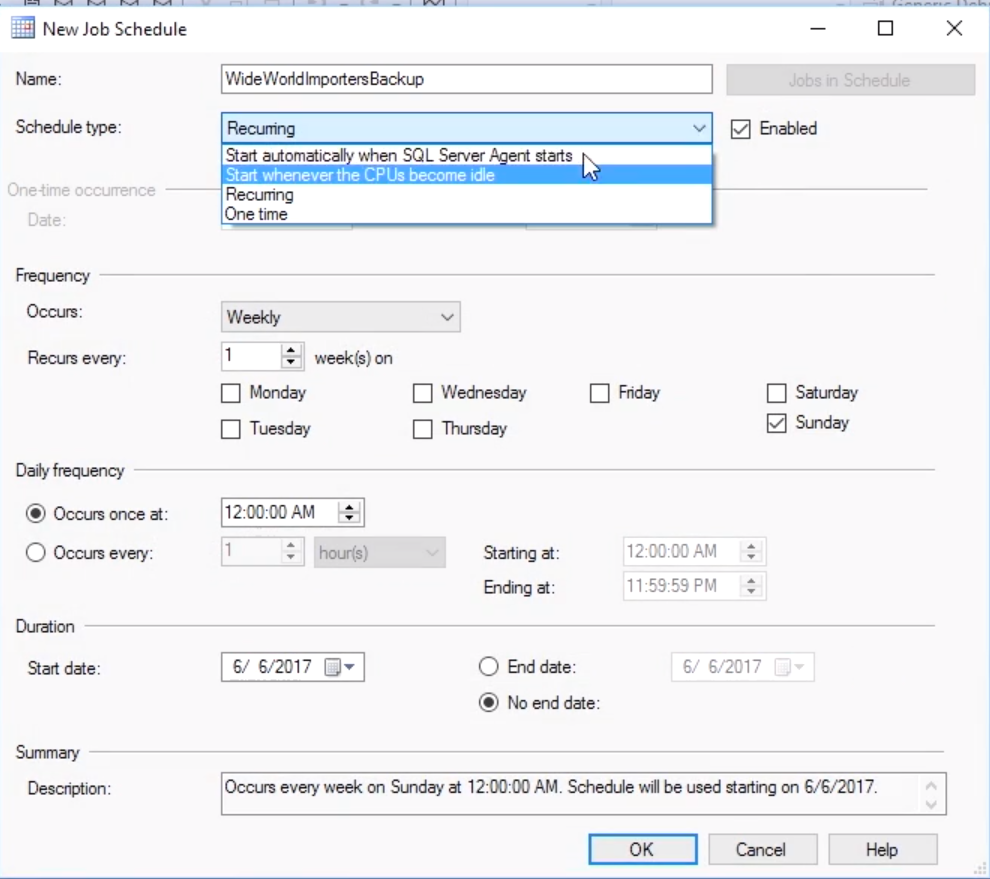

Select the tasks and the order of execution

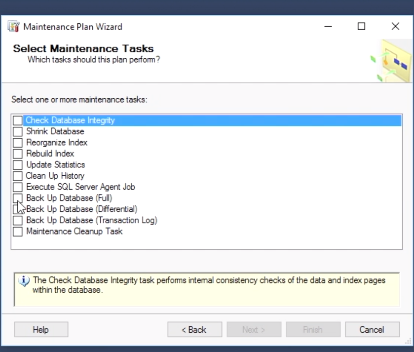

Select the database(s) and backup destination and other options

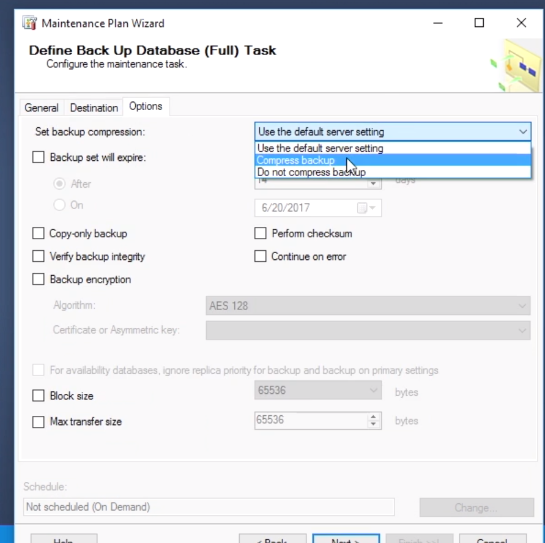

Select reporting options and finish

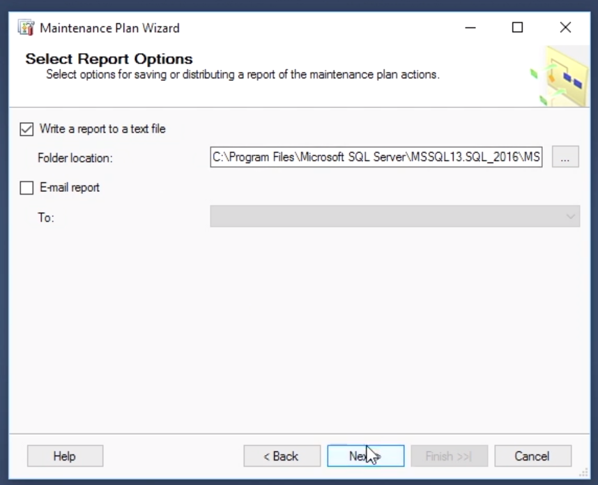
