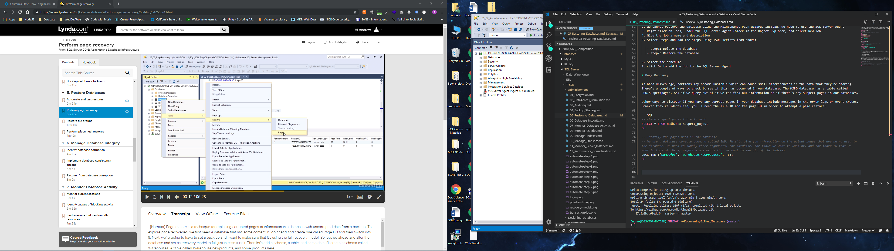

# Automate Restores

When a production database is live, you probably want to avoid working in it as you develop new features and enhance procedures. You'll most likely create a duplicate testing server that will act as your development playground. However, it would be nice to have a regular update with live data so that your development or test server work mirrors the production server as closely as possible. We can do that by creating a backup of the production database and restoring it to a testing database. As a bonus, the process can be automated using the SQL server agent.

```sql
-- create a new database for this example
CREATE DATABASE ProductionDB;
GO
USE ProductionDB;
-- set the recovery model if needed
-- remember that the full recovery model will create a backup transaction log
ALTER DATABASE ProductionDB SET RECOVERY FULL;
GO
-- add a table and some records
CREATE SCHEMA Warehouse;
GO
CREATE TABLE Warehouse.NewProducts (
    ProductID int IDENTITY(1,1) PRIMARY KEY,
    ProductName nvarchar(100) NOT NULL
);
GO
INSERT Warehouse.NewProducts
    VALUES  ('Salted Cashews'),
            ('Roasted Peanuts'),
            ('Honey Almonds');
GO


-- create full backup
BACKUP DATABASE ProductionDB
    TO DISK = 'C:\TempSQL\ProductionDB.bak'
    WITH FORMAT;
GO

-- if we forget the file names we can get the list of filenames within the backup set
RESTORE FILELISTONLY
   FROM DISK = 'C:\TempSQL\ProductionDB.bak';


-- Now we can restore the production database to a test database
RESTORE DATABASE TestServerDB
   FROM DISK = 'C:\TempSQL\ProductionDB.bak'
   WITH MOVE 'ProductionDB' TO 'C:\TempSQL\TestServerDB.mdf',
        MOVE 'ProductionDB_log' TO 'C:\TempSQL\TestServerDB.ldf',
        RECOVERY;
GO
```

## AUTOMATING THE PROCESS

1. Automate the backup process using the Maintenance Plan Wizard.
2. We cannot restore the database using the Maintenance Plan Wizard. Instead, we need to use the SQL Server Agent
3. Right-click on Jobs, under the SQL Server Agent folder in the Object Explorer, and select New Job
4. Give the job a name and description
5. Select Steps and add the steps using TSQL scripts from above:

   - step1: Delete the database
   - step2: Restore the database

6. Select the schedule
7. click OK to add the job to the SQL Server Agent

# Page Recovery

As hard drives age, portions may become unstable which can cause small discrepancies in the data that they're storing. There's a couple of ways to check to see if this has occurred in our database. The MSBD database has a table called DBO.suspectpages. And if we query out of it we can find out information on if there's any suspect pages in our databases.

Other ways to discover if you have any corrupt pages in your database include messages in the error logs or event traces. However they're identified, you'll need the file ID and the page ID in order to attempt a page restore.

```sql
-- check suspect_pages table in msdb
SELECT * FROM msdb.dbo.suspect_pages;
GO

-- Identify the pages used in the database
-- We use a database console command called IND. This'll give you information on the actual pages that are being used in the database. We need to supply three arguments: the database, the table we want to look at, and the index ID that we want to look at. Here, negative one means that we want to see all of the indexes.
DBCC IND ('NameOfDB', 'Warehouse.NewProducts', -1);
GO

```

We can restore the page by righ-clicking on the database, under tasks, under restore, select page.



When the restore window menu pops up we can add the pages we want to restore using the File ID and Page ID

# Restoring Filegroups

If you're leveraging file groups to segment out your data, especially when following best practices and storing them on different drives, then it's possible that a single file group's data file may become corrupted or otherwise go offline. When this happens, there's no need to perform a full database restore. After all, the rest of the file groups are all still safe and sound. By only restoring the file groups that need it, you can speed up the restoration process.

# Piecemeal Restores

There's another benefit to multiple file groups when it comes time to doing a full database restore and it's something called a piecemeal restore.

With this technique the database can be brought online as soon as the primary file group and any other read, write file groups are done being restored. This allows users to start working with the most common data tables and it allows the database administrator the time to finish bringing the secondary read only file groups online at a later point.
