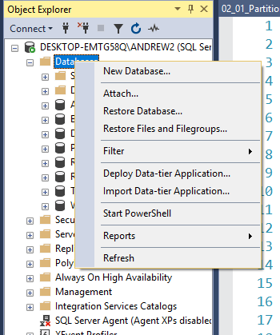
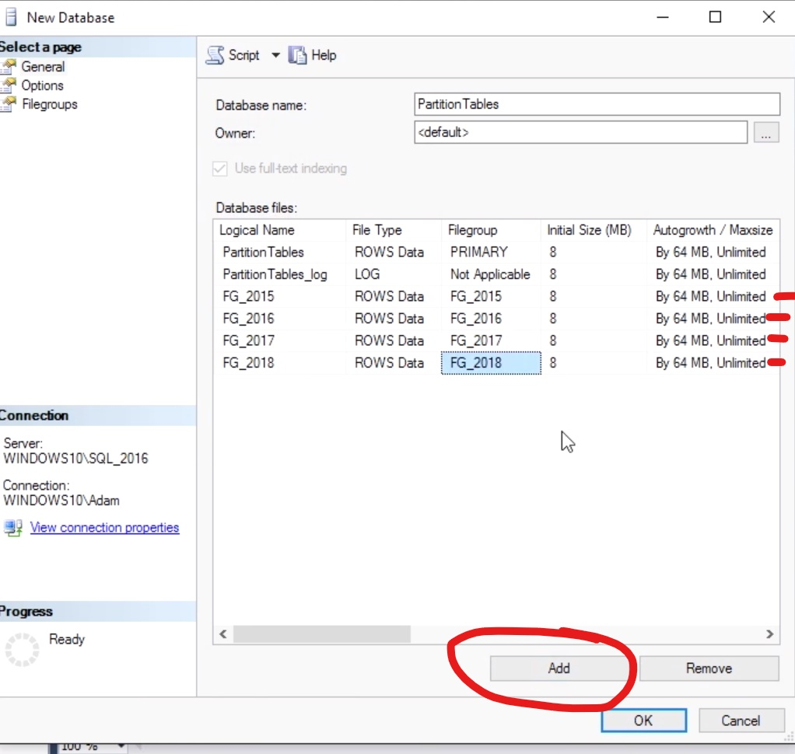
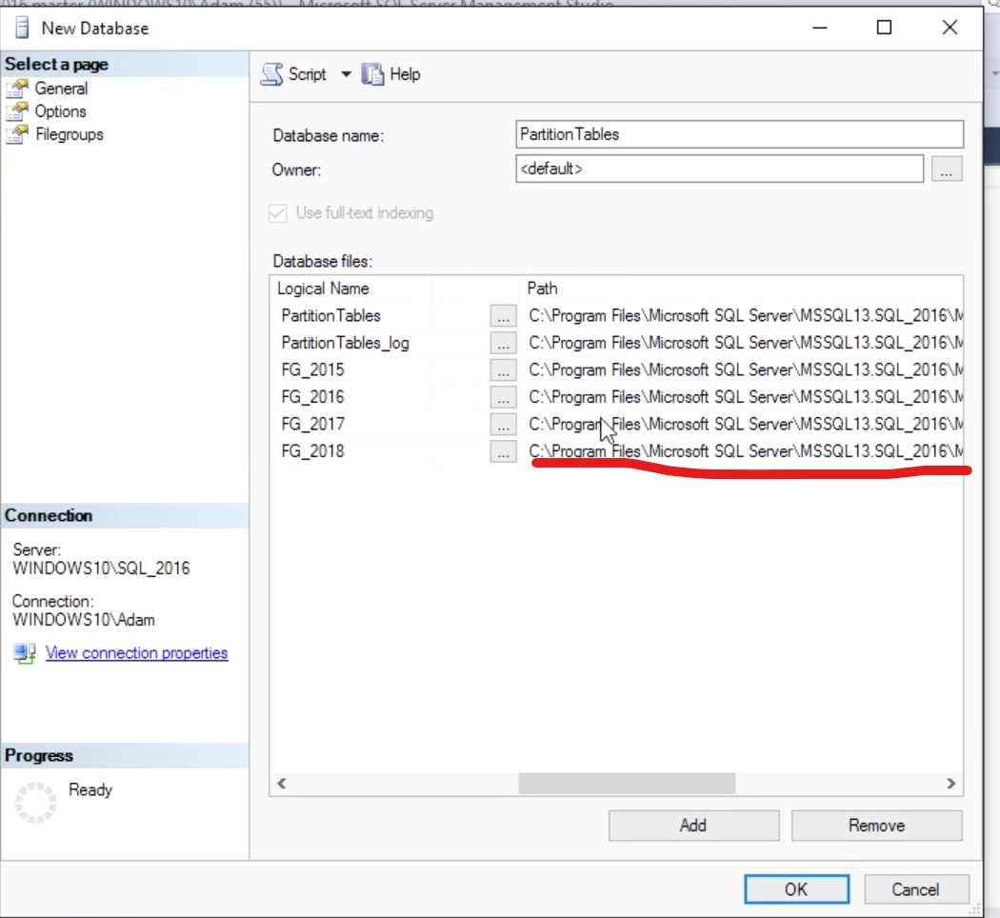

# Partitioning Large Tables

When data tables get very large with records numbering in the millions, it might be beneficial to consider creating partition tables. Partition tables are tables that have been split up horizontally so that collections of records can be spread out across multiple hard drives. This is accomplished by leveraging SQL Server filegroups, which serve as the physical location or containers that store the database objects. By spreading a single table across several filegroups, that, themselves, are stored on separate hard drives, you can increase the performance of reads and writes on the tables, since those operations can be performed simultaneously across partitions.

# 4 Steps to Partition Tables

## Step 1: CREATE FILEGROUP(S)

The physical location on disk where the records will be stored

right-click and create a new database



add the filegroups



in a live database environment the filegroups are ideally stored on seperate hard drives.
scroll right to set the file path



## Step 2: CREATE A PARTITION FUNCTION

Evaluates the data in a table and segments the data based on rules specified in the function

```sql

```

## Step 3: CREATE PARTITION SCHEME

Maps the segments from the function to the physical filegroups for storage

```sql

```

## Step 4: CREATE THE TABLE

Create as normal, but specify the Partition Scheme as the storage location

```sql

```
