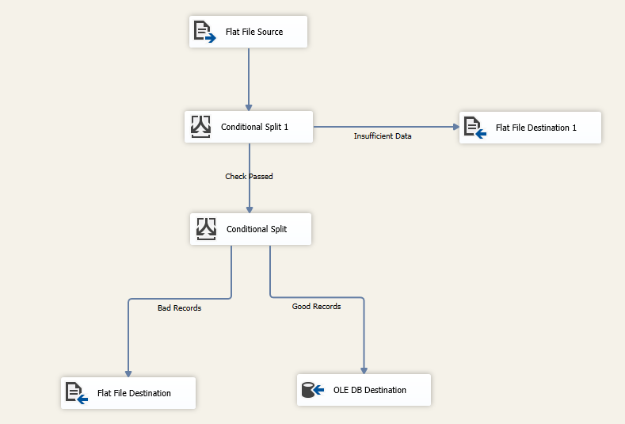
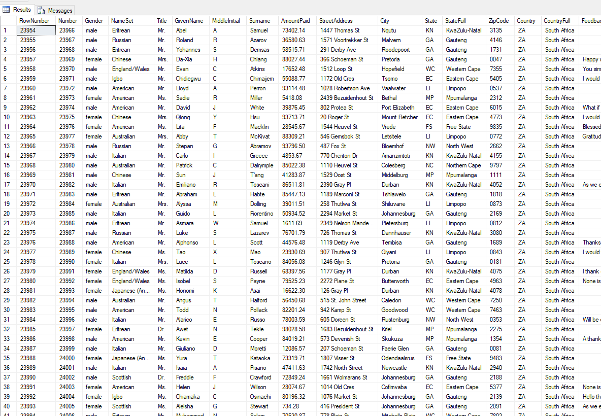

# ETL Error Handling Project

In this project we use a data set FakeNames.csv and go through the ETL process in SSIS. The csv files has intentional errors to force us to troubleshoot throughout the process.

In this project we learned:

- How Excel can mess up our data
- How to correctly open files in Excel via the Text Import Wizard
- How to handle data truncation in SSIS
- Everything about Text Qualifiers
- What to do when your source file is corrupt
- Finding anomalies with SQL
- How to use Conditional Splits to create powerful projects in SSIS
- How to automate error handling in SSIS
- The important of due diligence check for QA
  - double check your database records count
  - don't forget to disable your package once you have loaded the data
- Types of Errors in SSIS

# Final SSIS Package

# Final DB Upload

