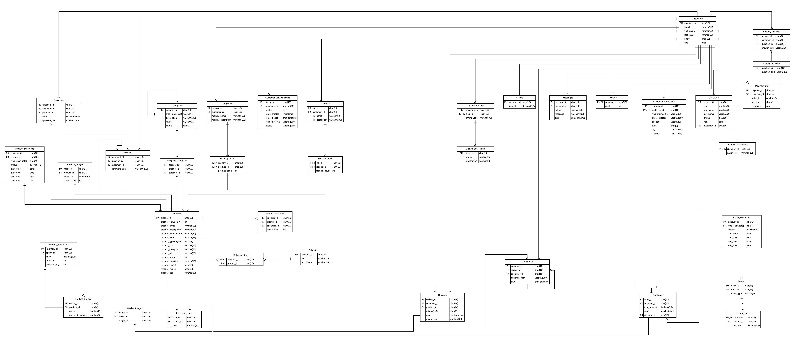

# E-commerce Database Project

Developing a database for an e-commerce web application.

# ER Diagram

# Tables

- Customers.Customers
- Customers.Addresses
- Customers.Passwords
- Customers.SecurityQuestions
- Customers.SecurityAnswers
- Customers.PaymentInfo
- Customers.Rewards
- Customers.Messages
- Customers.Credits
- Customers.CustomFields
- Customers.CustomInfo
- Customers.CustomerServiceIssues
- Products.Products
- Customers.Wishlists
- Customers.WishlistItems
- Customers.Registries
- Customers.RegistryItems
- Products.Categories
- Products.AssignedCategories
- Products.Images
- Products.Questions
- Products.Answers
- Products.Discounts
- Products.Packages
- Products.Collections
- Products.CollectionItems
- Products.Options
- Product.Inventories
- Products.Reviews
- Products.ReviewComments
- Products.ReviewImages
- Orders.Discounts
- Orders.Purchases
- Orders.PurchaseItems
- Orders.Returns
- Orders.ReturnItems
- Orders.GiftCards
